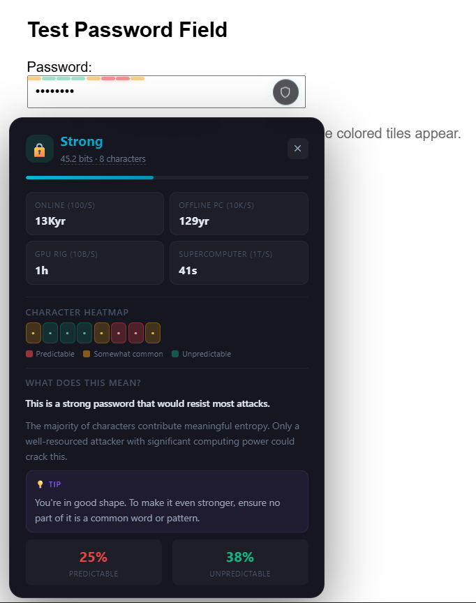

#  secureLens

> **See the invisible.** A Chrome extension that turns your password field into a real-time heatmap of predictability — powered by 14 million leaked passwords.

---

##  What Is This?

secureLens doesn't just tell you "weak" or "strong." It shows you **exactly which characters** in your password an attacker would guess first, character by character, in real-time.

Type `password123` and watch it light up **red** — every single tile. Type a random passphrase and watch it glow **green**. The difference isn't magic. It's math.



---

##  How It Works

### The Core Idea: Trigram Analysis

Every password is a sequence of characters. Humans are terrible at being random. We use patterns — `123`, `abc`, `qwe`, `pas` — over and over. secureLens learned these patterns by reading **14,344,391 real leaked passwords**.

For every character you type, it asks: *"Given the two characters before this one, how likely is a human to type this next character?"*

- After `pa` → `s` is **38% likely** (from "password", "passion", etc.)
- After `12` → `3` is **71% likely** (from "123", "1234", "12345")
- After `zq` → `7` is **0.01% likely** (nobody types this)

### The Math

#### 1. Conditional Probability

For each context pair `(c₁, c₂)` and next character `c₃`:

```
P(c₃ | c₁c₂) = count(c₁, c₂, c₃) / Σ count(c₁, c₂, x)
```

We apply **Laplace smoothing** (add-1) so unseen transitions don't break the model:

```
P(c₃ | c₁c₂) = (count + 1) / (total + unique_chars)
```

#### 2. Shannon Entropy

The total entropy of your password is the sum of surprisal for each character:

```
H = -Σ log₂(P(cᵢ | cᵢ₋₂, cᵢ₋₁))
```

Each bit of entropy **doubles** the search space. A 40-bit password requires 2⁴⁰ guesses. A 60-bit password requires 2⁶⁰ — that's **a million times harder**.

#### 3. Crack Time Estimates

We convert entropy bits into real-world cracking times across four scenarios:

| Scenario | Speed | What it means |
|---|---|---|
| **Online (100/s)** | 100 guesses/sec | A login form with rate limiting |
| **Offline PC (10K/s)** | 10,000/sec | A stolen database cracked on a laptop |
| **GPU Rig (10B/s)** | 10,000,000,000/sec | 8× RTX 4090s running Hashcat |
| **Supercomputer (1T/s)** | 1,000,000,000,000/sec | Nation-state resources |

```
crack_time = 2^entropy_bits / guesses_per_second
```

---

##  Architecture

```
┌─────────────────────────────────────────────────┐
│                  Chrome Extension               │
│                                                 │
│  ┌──────────────────┐    ┌────────────────────┐ │
│  │  content.js      │◄──►│  background.js     │ │
│  │                  │    │  (model loader)    │ │
│  │  • Detects       │    │                    │ │
│  │    password      │    │  Loads & caches    │ │
│  │    fields        │    │  trigrams.json.gz  │ │
│  │  • Renders       │    │                    │ │
│  │    heatmap tiles │    │  Responds to       │ │
│  │  • Shows panel   │    │  analyze requests  │ │
│  └──────────────────┘    └────────────────────┘ │
│                                                 │
│  ┌──────────────────┐    ┌────────────────────┐ │
│  │  Heatmap Overlay │    │  Stats Panel       │ │
│  │                  │    │                    │ │
│  │  Thin colored    │    │  • Strength label  │ │
│  │  bar at bottom   │    │  • Entropy bits    │ │
│  │  of password     │    │  • 4 crack-time    │ │
│  │  field           │    │    scenarios       │ │
│  │                  │    │  • Character       │ │
│  │  Click shield ►  │    │    heatmap         │ │
│  │  full stats      │    │  • Plain-English   │ │
│  └──────────────────┘    │    explanation     │ │
│                          └────────────────────┘ │
└─────────────────────────────────────────────────┘

┌─────────────────────────────────────────────────┐
│              Data Pipeline (Python)              │
│                                                  │
│  rockyou.txt ──► build_model.py ──► trigrams.json│
│  (14.3M pw)    (count trigrams,  │  (2.8 MB)    │
│                 Laplace smooth)  │              │
│                                  ▼              │
│                          compress_trie.py       │
│                          (prune + gzip)         │
│                                  │              │
│                                  ▼              │
│                        trigrams.json.gz         │
│                        (0.74 MB)                │
└─────────────────────────────────────────────────┘
```

---

## 📊 The Color System

Each character tile is colored based on its transition probability:

| Color | Threshold | Meaning |
|---|---|---|
| 🔴 **Red** | > 10% probability | An attacker would guess this character early. This is a weak link. |
| 🟡 **Amber** | 1–10% probability | Somewhat common. Not terrible, but not great. |
| 🟢 **Green** | < 1% probability | Unpredictable. This character adds real entropy. |

The **shield badge** on the right side of the password field glows with the overall strength color. Click it to open the full analysis panel.

---

##  Quick Start

### Prerequisites

- **Python 3.11+** — for building the trigram model
- **Chrome 88+** — for `DecompressionStream` API support
- **rockyou.txt** — the password corpus (not included, not committed to git)

### Step 1: Build the Model

```bash
# Place rockyou.txt in data/
python scripts/build_model.py

# Output: data/trigrams.json (~2.8 MB)
```

This processes all 14.3M passwords and outputs a JSON model with 6,423 context entries and 267,230 (context, character) probability pairs.

### Step 2: Compress for the Extension

```bash
python scripts/compress_trie.py

# Output: extension/data/trigrams.json.gz (~0.74 MB)
# Compression ratio: 3.8x
```

Prunes low-probability pairs (< 0.1%) and gzip-compresses. The extension loads this at startup using the browser's native `DecompressionStream` API.

### Step 3: Load in Chrome

1. Open `chrome://extensions`
2. Enable **Developer mode** (top-right toggle)
3. Click **Load unpacked**
4. Select the `extension/` folder
5. Done. Visit any login page and start typing.

---

##  Project Structure

```
secureLens/
├── data/
│   ├── rockyou.txt              ← Raw corpus (gitignored, ~140 MB)
│   └── trigrams.json            ← Compiled model (gitignored, ~2.8 MB)
├── scripts/
│   ├── build_model.py           ← Corpus processor & trigram counter
│   └── compress_trie.py         ← JSON pruning & gzip compression
├── extension/
│   ├── manifest.json            ← MV3 extension manifest
│   ├── background.js            ← Service worker (model loading)
│   ├── content.js               ← Content script (all-in-one bundled)
│   ├── popup.html               ← Extension popup UI
│   ├── popup.js                 ← Popup logic
│   ├── data/
│   │   └── trigrams.json.gz     ← Compressed model (~0.74 MB)
│   ├── lib/
│   │   ├── trigram_engine.js    ← Core lookup (dev/testing)
│   │   └── entropy_calc.js      ← Entropy math (dev/testing)
│   ├── ui/
│   │   ├── heatmap_overlay.js   ← Tile renderer (dev/testing)
│   │   └── tooltip.js           ← Pattern tooltips (dev/testing)
│   ├── styles/
│   │   └── overlay.css          ← Tile styles (dev/testing)
│   ├── icons/
│   │   ├── icon16.png
│   │   ├── icon48.png
│   │   └── icon128.png
│   └── test_page.html           ← Local test page
├── tests/
│   ├── test_engine.js           ← Trigram engine unit tests
│   └── test_entropy.js          ← Entropy calculation unit tests
├── .gitignore
└── README.md
```

> **Note:** The `lib/`, `ui/`, and `styles/` folders contain modular source code for development and testing. The production `content.js` is a self-contained bundle (no ES modules) since Chrome content scripts don't support `import`/`export`.

---

## 🔬 How the Model Was Built

### Data Source

The **rockyou.txt** corpus — 14,344,391 passwords leaked from the 2009 RockYou breach. It remains the most widely-used password dataset for security research.

### Processing Pipeline

1. **Filter:** Skip passwords shorter than 3 characters (385 skipped)
2. **Pad:** Prefix each password with two null characters (`\x00\x00`) to bootstrap context for the first two characters
3. **Count:** Extract every trigram `(cₙ₋₂, cₙ₋₁, cₙ)` and increment its count
4. **Smooth:** Apply Laplace (add-1) smoothing to avoid zero-probability transitions
5. **Prune:** Remove contexts with fewer than 50 total observations
6. **Filter:** Drop individual (context, char) pairs with probability < 0.1%
7. **Compress:** Round to 4 decimal places, serialize to compact JSON, gzip at level 9

### Model Stats

| Metric | Value |
|---|---|
| Passwords processed | 14,344,391 |
| Unique contexts | 16,222 |
| Contexts after pruning | 6,423 |
| (Context, char) pairs kept | 267,230 |
| Pairs pruned | 67,425 |
| Raw JSON size | 2.82 MB |
| Compressed size | 0.74 MB |
| Compression ratio | 3.8× |

---

##  Testing

```bash
node tests/test_engine.js    # 14 tests — probability lookups, Laplace floor, classification
node tests/test_entropy.js   # 13 tests — entropy calculation, labels, colors, edge cases
```

All 27 tests pass. 

---

##  Privacy & Security

secureLens is designed with a **zero-knowledge** philosophy:

- **No password characters are ever logged, stored, or transmitted.** The overlay displays `•` only.
- **All computation happens locally.** The model is bundled in the extension. No network requests.
- **No data leaves your machine.** Not to our servers (we don't have any), not to third parties, not to Google.
- **The background worker only receives 2-character context strings** — never the full password.
- **`chrome.storage` is used only for user preferences** (overlay toggle, sensitivity). Never for password-derived data.

---

##  Performance

| Metric | Target | Actual |
|---|---|---|
| Model load time | < 500ms | ~200ms (0.74 MB gzip) |
| Analysis latency | < 16ms (1 frame) | ~2ms (pure dictionary lookup) |
| Content script overhead | < 1ms per keystroke | ~0.5ms |
| Memory footprint | < 50 MB | ~30 MB (model in memory) |
| Debounce interval | 80ms | 80ms |

---

##  Design Decisions

### Why a thin bar + clickable badge instead of always-visible panel?

Password fields are sacred real estate. Covering them with a giant panel breaks the typing experience. The thin colored bar gives **instant, at-a-glance feedback** without getting in the way. Click the shield when you want the full breakdown.

### Why trigrams and not bigrams or 4-grams?

- **Bigrams** lose too much context — `pa` could lead to `s`, `r`, `u`, `l`... not specific enough.
- **4-grams** explode the model size exponentially and capture very specific phrases rather than general patterns.
- **Trigrams** hit the sweet spot: enough context to be predictive, compact enough to fit in a browser extension.

### Why Laplace smoothing?

Without smoothing, an unseen transition would have probability 0, making entropy infinite. Laplace smoothing assigns a small non-zero probability to unseen events, which is both mathematically sound and practically useful — if you invent a completely novel character sequence, you *should* get high entropy for it.

### Why Shannon entropy and not zxcvbn?

[zxcvbn](https://github.com/dropbox/zxcvbn) is excellent but uses dictionary matching, pattern detection, and heuristics. secureLens uses a **pure statistical model** trained on real data. It doesn't know what "password" means — it just knows that after `pa`, the letter `s` appears 38% of the time in real leaked passwords. This makes it more generalizable and less gameable.

---

## 🛠️ Dependencies

| Component | Dependency | Why |
|---|---|---|
| `build_model.py` | Python 3.11+ standard library only | `collections.defaultdict`, `json`, `gzip`, `argparse` |
| `compress_trie.py` | Python 3.11+ standard library only | `gzip`, `json`, `os` |
| `content.js` | Chrome 88+ | `DecompressionStream` API for gzip decompression |
| `background.js` | Chrome 88+ | ES modules in service workers (`"type": "module"`) |
| Tests | Node.js 18+ | Native ESM support for running `.js` test files |

**Zero npm packages. Zero build tools. Zero frameworks.** Just vanilla JavaScript and Python stdlib.

---

##  How to Extend

### Add new known patterns

Edit the `KNOWN_PATTERNS` object in `content.js`:

```js
"xyz": { freq: "2%", tip: "Reverse alphabetical — still predictable." },
```

### Adjust sensitivity thresholds

Edit `classifyTransition()` in `content.js`:

```js
function classifyTransition(prob) {
  if (prob > 0.05) return "high";    // was 0.10 — stricter
  if (prob > 0.005) return "medium"; // was 0.01 — stricter
  return "low";
}
```

### Rebuild with a different corpus

Place any line-separated password file in `data/` and run:

```bash
python scripts/build_model.py --input data/your_corpus.txt
python scripts/compress_trie.py
```

---

##  License

MIT. Do whatever you want with it. Just don't blame me if your password is still `password123`.

---

##  Contributing

Found a bug? Have a better pattern? Open an issue or PR. The model is only as good as the data, and there's always room for improvement.

---

<p align="center">
  <em>Built because "password123" is still in the top 10 most common passwords in 2026. We can do better.</em> 
</p>
